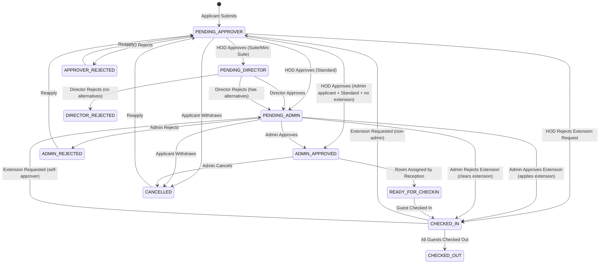
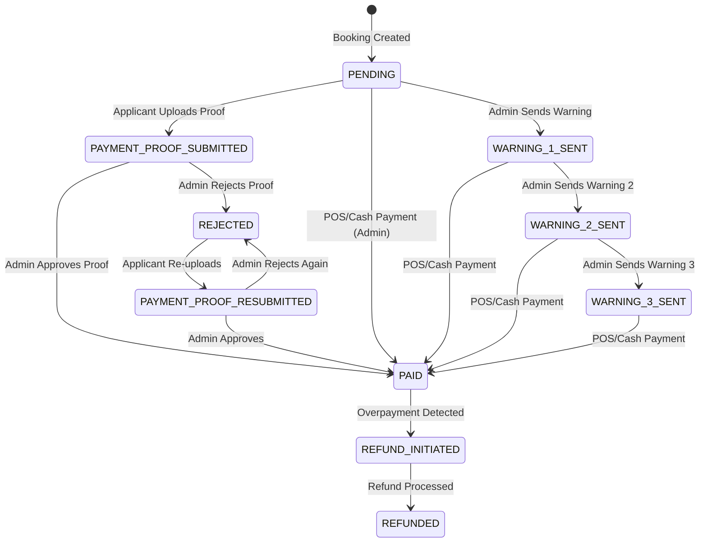
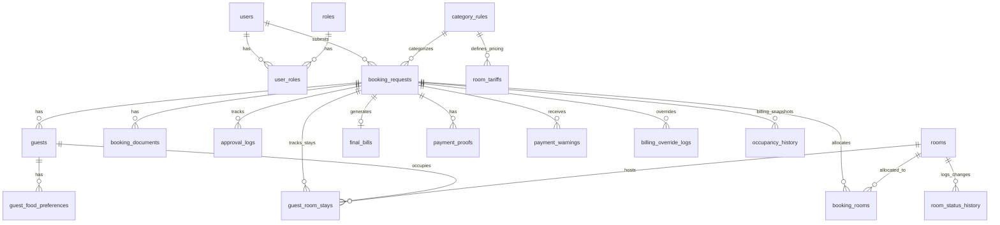
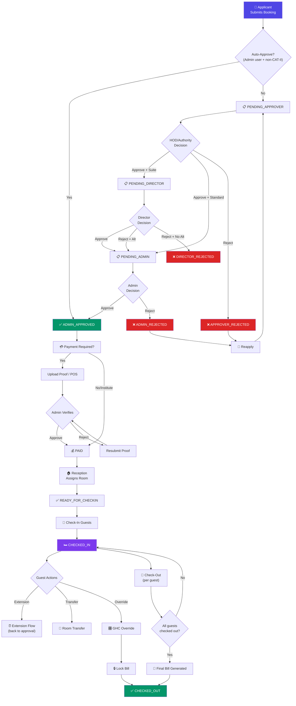

# 🏨 NIT Guest House — Complete System Workflows & Feature Routes

> **Purpose**: A single source of truth for every workflow, state machine, data flow, and identified gap in the system. Designed for both AI and human developers.
> **Generated from**: Full codebase analysis of 39 API endpoints, 6 backend services, 7 frontend pages, 24 database tables, and 51 rooms.

---

## Table of Contents

1. [System Architecture Overview](#1-system-architecture-overview)
2. [🔑 Master State Machine — Booking Lifecycle](#2--master-state-machine--booking-lifecycle)
3. [📋 Flow 1 — Application Submission](#3--flow-1--application-submission)
4. [✅ Flow 2 — Approval Routing](#4--flow-2--approval-routing)
5. [💳 Flow 3 — Payment Pipeline](#5--flow-3--payment-pipeline)
6. [🏠 Flow 4 — Room Assignment & Check-In (Reception)](#6--flow-4--room-assignment--check-in-reception)
7. [🚪 Flow 5 — Check-Out & Billing](#7--flow-5--check-out--billing)
8. [⏰ Flow 6 — Stay Extension](#8--flow-6--stay-extension)
9. [🔄 Flow 7 — Room Transfer](#9--flow-7--room-transfer)
10. [🎛️ Flow 8 — GH Coordinator Override & Bill Locking](#10--flow-8--gh-coordinator-override--bill-locking)
11. [✏️ Flow 9 — Edit / Reapply Application](#11--flow-9--edit--reapply-application)
12. [❌ Flow 10 — Cancellation / Withdrawal](#12--flow-10--cancellation--withdrawal)
13. [🍽️ Flow 11 — Food Management](#13--flow-11--food-management)
14. [📊 Dashboard Feature Matrix](#14--dashboard-feature-matrix)
15. [🗄️ Database Entity Relationship Summary](#15--database-entity-relationship-summary)
16. [🐛 Discovered Bugs, Gaps & Inconsistencies](#16--discovered-bugs-gaps--inconsistencies)
17. [🗺️ Master Flow Diagram](#17--master-flow-diagram)

---

## 1. System Architecture Overview

```mermaid
graph LR
    subgraph Frontend["Frontend (React + Vite)"]
        A[BookingPage] --> B[PreviewPage]
        C[ApplicantDashboard]
        D[ApproverDashboard]
        E[AdminDashboard]
        F[ReceptionDashboard]
        G[GHCoordinatorDashboard]
    end

    subgraph Backend["Backend (Express.js)"]
        H[Auth Routes]
        I[Booking Routes]
        J[Approval Routes]
        K[Payment Routes]
        L[Reception Routes]
        M[Coordinator Routes]
    end

    subgraph Services["Business Logic Layer"]
        N[auth.service]
        O[booking.service]
        P[approval.service]
        Q[payment.service]
        R[reception.service]
        S[coordinator.service]
    end

    subgraph DB["PostgreSQL"]
        T[("24 Tables")]
    end

    Frontend --> Backend --> Services --> DB
```



### Role → Dashboard Mapping

| Role | Dashboard | Route |
|---|---|---|
| `student`, `faculty`, `staff` | Applicant Dashboard | `/dashboard` |
| `hod`, `dean`, `registrar`, `director`, `faculty` | Approver Dashboard | `/approvals/dashboard` |
| `super_admin`, `guest_house_admin` | Admin Dashboard | `/admin/dashboard` |
| `reception_staff` | Reception Dashboard | `/reception/dashboard` |
| `gh_coordinator` | GH Coordinator Dashboard | `/coordinator/dashboard` |

> ⚠️ `super_admin` and `guest_house_admin` can also access Reception and Coordinator dashboards.

---

## 2. 🔑 Master State Machine — Booking Lifecycle



### Payment State Machine



---

## 3. 📋 Flow 1 — Application Submission

```
APPLICANT opens /book
    │
    ├── Fetches tariffs → GET /bookings/tariffs
    ├── Selects category → GET /bookings/authorities?category_id={id}
    ├── Fills multi-step form:
    │   ├── Step 1: Category & Visit Type
    │   │   └── CAT-I & CAT-II: visit_type locked to "official"
    │   │   └── CAT-I/CAT-II: relation field hidden
    │   ├── Step 2: Stay Details (dates, room type, rooms count)
    │   │   └── Suite/Mini Suite: shows ⚠️ 5-stage Director route warning
    │   ├── Step 3: Guest Details (per guest: name, phone, email, meals, ID proof)
    │   │   └── Each guest gets food preferences per day (B/L/D checkboxes)
    │   │   └── Each guest gets individual arrival/departure dates
    │   ├── Step 4: Documents & Approver Selection
    │   └── Step 5: Preview & Submit → navigates to /preview
    │
    ▼
PREVIEW PAGE (/preview)
    │
    ├── Shows full summary with night-by-night cost breakdown
    ├── Applicant clicks "Confirm & Submit"
    │
    ├── POST /bookings (FormData with JSON payload + document files)
    │
    ▼
BACKEND — booking.service.submitBookingRequest()
    │
    ├── Validates user role against category_rules.allowed_applicant_roles
    ├── Inserts into: booking_requests, guests, guest_food_preferences, booking_documents
    ├── Calculates total via estimateBookingTotalFromTariffs()
    ├── Logs 'SUBMITTED' in approval_logs
    │
    ├── IF user is super_admin/guest_house_admin AND category ≠ CAT-II:
    │   └── AUTO-APPROVE → booking_state = ADMIN_APPROVED
    │
    ├── IF assigned_approver === self:
    │   └── SELF-APPROVE → booking_state = PENDING_ADMIN
    │
    └── DEFAULT → booking_state = PENDING_APPROVER
```

**Files involved:**
- Frontend: [BookingPage.jsx](file:///c:/Users/keert/GuestHouse/guesthouse/frontend/src/pages/booking/BookingPage.jsx), [PreviewPage.jsx](file:///c:/Users/keert/GuestHouse/guesthouse/frontend/src/pages/booking/PreviewPage.jsx)
- Backend: [booking.routes.js](file:///c:/Users/keert/GuestHouse/guesthouse/backend/src/routes/booking.routes.js), [booking.service.js](file:///c:/Users/keert/GuestHouse/guesthouse/backend/src/services/booking.service.js)

---

## 4. ✅ Flow 2 — Approval Routing

```
                        ┌──────────────────────────────────┐
                        │      PENDING_APPROVER            │
                        │  (Visible to assigned authority)  │
                        └───────────┬──────────────────────┘
                                    │
                    ┌───────────────┼───────────────┐
                    ▼               ▼               ▼
              HOD APPROVES    HOD APPROVES     HOD REJECTS
             (Suite/Mini)     (Standard)
                    │               │               │
                    ▼               │               ▼
          PENDING_DIRECTOR          │       APPROVER_REJECTED
                    │               │         (Terminal — can Reapply)
        ┌───────────┼───────┐       │
        ▼                   ▼       │
   DIR APPROVES        DIR REJECTS  │
        │               │          │
        ▼               ▼          │
   PENDING_ADMIN    Has Alt?       │
                    ├─Y→ PENDING_ADMIN
                    └─N→ DIRECTOR_REJECTED
                              │
                              │ All paths merge ▼
                        ┌──────────────────┐
                        │   PENDING_ADMIN   │
                        │ (Admin Dashboard)  │
                        └───────┬──────────┘
                                │
                    ┌───────────┼───────────┐
                    ▼                       ▼
              ADMIN APPROVES          ADMIN REJECTS
                    │                       │
                    ▼                       ▼
              ADMIN_APPROVED          ADMIN_REJECTED
                                     (Terminal — can Reapply)
```

**API Endpoints:**
| Action | Endpoint | Called By |
|---|---|---|
| Get pending approvals | `GET /approvals/pending` | ApproverDashboard |
| Approve/Reject/Withdraw | `POST /approvals/{id}` | ApproverDashboard |
| Admin Approve/Reject | `PATCH /bookings/{id}/admin-status` | AdminDashboard |

**Files involved:**
- Frontend: [ApproverDashboard.jsx](file:///c:/Users/keert/GuestHouse/guesthouse/frontend/src/pages/dashboard/ApproverDashboard.jsx), [AdminDashboard.jsx](file:///c:/Users/keert/GuestHouse/guesthouse/frontend/src/pages/dashboard/AdminDashboard.jsx)
- Backend: [approval.service.js](file:///c:/Users/keert/GuestHouse/guesthouse/backend/src/services/approval.service.js)

---

## 5. 💳 Flow 3 — Payment Pipeline

```
BOOKING reaches ADMIN_APPROVED
    │
    ├── IF payment_responsible = 'institute' → payment_state = NOT_APPLICABLE → Skip
    │
    └── OTHERWISE → payment_state = PENDING
            │
            ▼
    APPLICANT sees "Pay / Upload Proof" button
            │
            ├── Uploads payment receipt file
            │   POST /payments/{id}/proof (FormData with payment_proof file)
            │   → payment_state = PAYMENT_PROOF_SUBMITTED
            │
            ▼
    ADMIN sees proof in Payments tab
            │
            ├── Opens AdminPaymentVerificationModal
            │   ├── Views uploaded file (image/PDF preview)
            │   ├── Views payment history & warnings
            │   │
            │   ├── APPROVE → POST /payments/{id}/verify {action: 'APPROVED'}
            │   │   → payment_state = PAID
            │   │   → Notification sent
            │   │
            │   ├── REJECT → POST /payments/{id}/verify {action: 'REJECTED', reason}
            │   │   → payment_state = REJECTED
            │   │   → Applicant can re-upload → PAYMENT_PROOF_RESUBMITTED
            │   │
            │   ├── SEND WARNING → POST /payments/{id}/warn {warning_level: 1|2|3}
            │   │   → payment_state = WARNING_X_SENT
            │   │
            │   └── POS/CASH PAYMENT → POST /payments/{id}/pos-complete
            │       → payment_state = PAID (marks as paid at counter)
            │
            ▼
    Once PAID → Reception can proceed with Check-In
```

**Files involved:**
- Frontend: [PaymentProofModal.jsx](file:///c:/Users/keert/GuestHouse/guesthouse/frontend/src/components/ui/PaymentProofModal.jsx), [AdminPaymentVerificationModal.jsx](file:///c:/Users/keert/GuestHouse/guesthouse/frontend/src/components/ui/AdminPaymentVerificationModal.jsx)
- Backend: [payment.service.js](file:///c:/Users/keert/GuestHouse/guesthouse/backend/src/services/payment.service.js)

---

## 6. 🏠 Flow 4 — Room Assignment & Check-In (Reception)

```
RECEPTION DASHBOARD — Arrivals Tab
    │
    ├── Sees "Received Applications" (state = ADMIN_APPROVED)
    │   └── Click "Block Room" → opens Preview modal
    │       ├── For each logical room (Room 1, Room 2...):
    │       │   └── Select physical room number from dropdown
    │       │       (filtered: only AVAILABLE rooms, no date conflicts)
    │       │
    │       └── Click "Assign Room" → POST /reception/{id}/assign-rooms
    │           ├── Validates no overlapping booking_rooms (tsrange check)
    │           ├── Creates booking_rooms records
    │           ├── booking_state → READY_FOR_CHECKIN
    │           └── Sets allocated_room_numbers on booking_requests
    │
    ├── Sees "Pending Arrivals" (state = READY_FOR_CHECKIN or CHECKED_IN)
    │   └── Click "Check In" per guest
    │       └── POST /reception/guests/{guestId}/check-in
    │           ├── Creates guest_room_stays record
    │           ├── Room → 'occupied'
    │           ├── booking_state → CHECKED_IN (first guest sets checked_in_at)
    │           └── Validates capacity (max 2 + 1 extra bed per room)
    │
RECEPTION DASHBOARD — Rooms Tab
    │
    ├── Room Status Cards (Available / Occupied / Cleaning / Maintenance)
    │
    ├── Available Rooms → shows future allocations
    ├── Occupied Rooms → shows active guests with:
    │   ├── Check-Out button (per guest) → POST /reception/stays/{stayId}/check-out
    │   ├── Transfer button → opens Transfer Modal
    │   ├── Vacate Room → POST /reception/{id}/check-out (bulk checkout)
    │   └── Live Billing Ledger (dynamic day-by-day pricing)
    │
    └── Cleaning Rooms → "Mark as Cleaned" button
        └── POST /reception/rooms/{roomNumber}/status {status: 'available'}
```

**Files involved:**
- Frontend: [ReceptionDashboard.jsx](file:///c:/Users/keert/GuestHouse/guesthouse/frontend/src/pages/dashboard/ReceptionDashboard.jsx)
- Backend: [reception.service.js](file:///c:/Users/keert/GuestHouse/guesthouse/backend/src/services/reception.service.js)

---

## 7. 🚪 Flow 5 — Check-Out & Billing

```
RECEPTION — Individual Guest Check-Out
    │
    POST /reception/stays/{stayId}/check-out
    │
    ├── 1. Validates no final_bill exists yet
    ├── 1a. Validates payment: CAT-III, CAT-IV, and CAT-II (if Guest is responsible) MUST be PAID before checkout
    ├── 2. Sets guest_room_stays.stay_status → CHECKED_OUT
    ├── 3. Generates occupancy_history (day-by-day tariff snapshot)
    ├── 4. If last guest in room:
    │   └── Room → 'cleaning'
    │
    ├── 5. Checks: are ALL guests checked out AND no future pending guests?
    │   ├── YES:
    │   │   ├── Calculates final billing (calendar-day occupancy × tariff + 12% GST)
    │   │   ├── Creates final_bills record (immutable snapshot)
    │   │   ├── Updates booking_rooms allocation end dates
    │   │   ├── booking_state → CHECKED_OUT
    │   │   ├── Sets checked_out_at timestamp
    │   │   └── Returns { bookingFinished: true } → triggers auto-open GST Invoice
    │   │
    │   └── NO:
    │       └── Booking stays CHECKED_IN (partial checkout)
    │
    ▼
GST INVOICE MODAL — auto-opens on last checkout
    ├── Fetches booking data or uses passed-in bookingData
    ├── If final_bills exists → uses locked numbers
    ├── Otherwise → calculates from total_estimated_amount
    ├── Displays: Tax Invoice with SAC codes, CGST/SGST @ 6%, amount in words
    └── Print / Save PDF button → window.print()
```

### Billing Calculation Logic (Reception Dashboard — Live Ledger)

```
For each CALENDAR DAY between check-in and check-out:
    │
    ├── Count ACTIVE guests in this room on this day
    │
    ├── 1 guest → Single Occupancy rate
    ├── 2 guests → Double Occupancy rate
    ├── 3+ guests → Double + Extra Bed (₹400 × extra beds per day)
    │
    └── Tariff depends on Category + Room Type:
        ├── Suite Room: ₹5500 (all categories, single & double same)
        ├── Mini Suite Room: ₹4000 (all categories)
        └── Standard Room:
            ├── CAT-I:  Single ₹1000 / Double ₹1600
            ├── CAT-II: Single ₹1100 / Double ₹1800
            ├── CAT-III: Single ₹1200 / Double ₹2000
            └── CAT-IV: Single ₹2600 / Double ₹2600
```

---

## 8. ⏰ Flow 6 — Stay Extension

```
APPLICANT (state = CHECKED_IN)
    │
    └── Clicks "Extend Stay" on ApplicantDashboard
        └── Opens modal → selects new departure datetime
            └── POST /bookings/{id}/stay-extension {new_departure_datetime}
                │
                ├── Validates: new date > current departure
                ├── Sets pending_extension_datetime on booking_requests
                │
                ├── IF applicant is super_admin/guest_house_admin:
                │   └── INSTANT APPLY → applyStayExtension()
                │       ├── Updates all guests.departure_datetime
                │       ├── Recalculates total_estimated_amount
                │       └── booking_state stays CHECKED_IN
                │
                ├── IF assigned_approver === self:
                │   └── booking_state → PENDING_ADMIN (skips HOD)
                │
                └── DEFAULT:
                    └── booking_state → PENDING_APPROVER
                        │
                        ▼ (Normal approval flow, but with special extension handling)
                        │
                        ├── HOD APPROVES → PENDING_ADMIN (ALWAYS, even for admin applicants)
                        ├── HOD REJECTS → CHECKED_IN (clears pending_extension)
                        │
                        ├── ADMIN APPROVES → applyStayExtension() → CHECKED_IN
                        └── ADMIN REJECTS → CHECKED_IN (clears pending_extension)

WITHDRAWAL of Extension:
    └── Applicant clicks "Withdraw" while extension is PENDING_*
        └── PATCH /bookings/{id}/cancel
            └── booking_state → CHECKED_IN (NOT cancelled — only extension withdrawn)
```

---

## 9. 🔄 Flow 7 — Room Transfer

```
RECEPTION — Rooms Tab — Occupied Room
    │
    └── Clicks "Transfer" on a guest
        └── Opens Transfer Modal
            ├── Shows: current room, guest name
            ├── Input: new room number
            ├── Input: remarks (reason)
            ├── Checkbox: "Transfer all guests in this room" (group mode)
            │
            └── Click "Confirm Transfer"
                └── POST /reception/rooms/transfer
                    {stayId, newRoomNumber, remarks, isGroup}
                    │
                    ├── 1. Validates final_bill does NOT exist (Rule 7)
                    ├── 2. Single transfer: blocked if room has multiple guests
                    │      (must use group transfer instead)
                    ├── 3. Validates target room is available + has capacity
                    │
                    ├── 4. ATOMIC TRANSACTION:
                    │   ├── Old stay → CHECKED_OUT + occupancy_history generated
                    │   ├── New stay created in target room
                    │   ├── Old room → 'cleaning' (if now empty)
                    │   ├── New room → 'occupied'
                    │   ├── Both room status changes logged in room_status_history
                    │   └── booking_requests.allocated_room_numbers updated
                    │
                    └── 5. booking_state stays CHECKED_IN (no state change)
```

---

## 10. 🎛️ Flow 8 — GH Coordinator Override & Bill Locking

```
GH COORDINATOR DASHBOARD
    │
    ├── Search by App ID or QR Scan
    │   └── GET /coordinator/bookings/{id}
    │
    ├── OVERRIDE PANEL (when booking selected):
    │   │
    │   ├── Global Settings:
    │   │   ├── Room Category/Type dropdown
    │   │   └── Total Estimated Amount (auto-synced with live calc)
    │   │
    │   ├── Per-Room Settings:
    │   │   ├── Manual Room Rate (₹/day) — overrides default tariff
    │   │   └── Manual Extra Bed Rate (₹/day) — overrides ₹400 default
    │   │
    │   ├── Per-Guest Settings:
    │   │   ├── Move to Room (dropdown) — reassign room_index
    │   │   └── Checkout Date (datetime picker)
    │   │
    │   ├── LIVE BILLING PREVIEW:
    │   │   └── Real-time calculation: Rooms + Extra Beds + Food = Subtotal
    │   │
    │   └── Override Reason (mandatory audit trail)
    │
    ├── ACTION BUTTONS:
    │   │
    │   ├── "Save Override Changes"
    │   │   └── PUT /coordinator/bookings/{id}/override
    │   │       ├── Updates booking_requests (room_type, dates, total)
    │   │       ├── Updates guests (departure, occupancy, extra_bed, room_index)
    │   │       ├── Updates guest_room_stays (operational fields)
    │   │       └── Creates audit_logs entry
    │   │
    │   ├── "Preview Demo Bill"
    │   │   └── Opens GSTInvoiceModal with LIVE override data (no DB write)
    │   │
    │   └── "Lock Bill & Send to Reception" / "Regenerate & Lock Bill"
    │       └── POST /coordinator/bookings/{id}/generate-bill
    │           ├── UPSERT into final_bills (ON CONFLICT → overwrites old bill)
    │           └── Updates booking_requests.total_estimated_amount
```

---

## 11. ✏️ Flow 9 — Edit / Reapply Application

### Edit (before final states)
```
APPLICANT clicks "Edit Application" on dashboard
    │
    ├── Blocked if state is: CHECKED_IN, CHECKED_OUT, COMPLETED, CANCELLED
    │
    └── Navigates to /booking?edit={id}
        ├── GET /bookings/{id} → pre-fills form
        ├── User edits form → navigates to /preview
        └── PUT /bookings/{id} (FormData)
            │
            ├── IF admin → keeps current state (logs 'ADMIN_CORRECTION')
            └── IF applicant → booking_state → PENDING_APPROVER (restart approval)
                └── Deletes non-active guest_room_stays
```

### Reapply (after rejection/cancellation)
```
APPLICANT clicks "Reapply" (from rejected/cancelled booking)
    │
    └── POST /bookings/{id}/reapply (FormData)
        ├── Allowed only if state is: APPROVER_REJECTED, ADMIN_REJECTED, CANCELLED
        ├── Deletes all old guests, re-inserts new ones
        ├── Increments version number
        └── booking_state → PENDING_APPROVER (full restart)
```

---

## 12. ❌ Flow 10 — Cancellation / Withdrawal

```
APPLICANT WITHDRAWAL:
    │
    ├── IF state is PENDING_APPROVER or PENDING_ADMIN (no checked-in):
    │   └── PATCH /bookings/{id}/cancel
    │       └── booking_state → CANCELLED
    │
    ├── IF state is CHECKED_IN (extension pending):
    │   └── PATCH /bookings/{id}/cancel
    │       └── booking_state → CHECKED_IN (extension withdrawn, NOT cancelled)
    │
    └── IF state is ADMIN_APPROVED or beyond:
        └── "Withdraw" button is HIDDEN in UI

ADMIN CANCELLATION:
    └── PATCH /bookings/{id}/cancel (from AdminDashboard)
        └── booking_state → CANCELLED

APPROVER WITHDRAWAL:
    └── POST /approvals/{id} {action: 'WITHDRAW'}
        └── booking_state → PENDING_APPROVER (reverts own approval)
```

---

## 13. 🍽️ Flow 11 — Food Management

```
BOOKING FORM (Step 3 — Guest Details):
    │
    ├── Per guest, per day:
    │   ├── Breakfast checkbox (0/1)
    │   ├── Lunch checkbox (0/1)
    │   └── Dinner checkbox (0/1)
    │
    └── Saved to guest_food_preferences table
        (preference_id, guest_id, meal_date, breakfast, lunch, dinner)

RECEPTION DASHBOARD — Food Tab:
    │
    ├── Date filter (defaults to today)
    ├── Shows aggregated meal counts across all active bookings
    └── Per-guest meal matrix (B/L/D checkmarks per day)

BILLING:
    └── Food costs calculated in GHC Live Preview:
        ├── Breakfast: ₹50 per serving
        ├── Lunch: ₹100 per serving
        └── Dinner: ₹100 per serving
```

---

## 14. 📊 Dashboard Feature Matrix

| Feature | Applicant | Approver | Admin | Reception | GH Coordinator |
|---|---|---|---|---|---|
| Submit Booking | ✅ | — | ✅ | — | — |
| View My Bookings | ✅ | — | ✅ | — | — |
| Edit Application | ✅ | — | ✅ | — | — |
| Reapply | ✅ | — | — | — | — |
| Upload Payment Proof | ✅ | — | — | — | — |
| Withdraw/Cancel | ✅ | ✅ | ✅ | — | — |
| Request Stay Extension | ✅ | — | — | — | — |
| Approve/Reject | — | ✅ | ✅ | — | — |
| Verify Payment | — | — | ✅ | — | — |
| Send Payment Warning | — | — | ✅ | — | — |
| POS Payment Complete | — | — | ✅ | ✅ | — |
| Assign Rooms | — | — | — | ✅ | — |
| Check-In Guests | — | — | — | ✅ | — |
| Check-Out Guests | — | — | — | ✅ | — |
| Room Transfer | — | — | — | ✅ | — |
| Billing Override | — | — | — | ✅ | — |
| Mark Room Cleaned | — | — | — | ✅ | — |
| Override Stay Details | — | — | — | — | ✅ |
| Manual Tariff Fix | — | — | — | — | ✅ |
| Lock/Regenerate Bill | — | — | — | — | ✅ |
| Preview Demo Bill | — | — | — | — | ✅ |
| QR Code Scan | — | — | — | ✅ | ✅ |
| View GST Invoice | ✅ | — | ✅ | ✅ | ✅ |
| View Room Matrix | — | — | — | ✅ | — |
| Food Requirements | — | — | — | ✅ | — |

---

## 15. 🗄️ Database Entity Relationship Summary



### Key Tables Count: 24 total
- **Core**: `users`, `roles`, `user_roles`, `booking_requests`, `guests`, `rooms`
- **Workflow**: `approval_logs`, `category_rules`, `room_tariffs`
- **Operations**: `guest_room_stays`, `booking_rooms`, `room_status_history`
- **Financial**: `final_bills`, `payment_proofs`, `payment_warnings`, `invoices`, `payments`, `refunds`, `occupancy_history`, `billing_override_logs`
- **Documents**: `booking_documents`
- **Audit**: `audit_logs`
- **Unused/Planned**: `workflow_definitions`, `workflow_steps`, `booking_workflow_instances`, `booking_approvals`, `notifications`, `sponsorship_requests`, `permissions`, `role_permissions`

---

## 16. 🐛 Discovered Bugs, Gaps & Inconsistencies

### 🔴 Critical Bugs

| # | Issue | Location | Impact |
|---|---|---|---|
| 1 | **Pricing mismatch**: `PRICING_CONFIG` in ReceptionDashboard was hardcoded with wrong rates (₹2000/₹3500 for Standard) instead of category-based rates. **FIXED** in latest session. | [ReceptionDashboard.jsx](file:///c:/Users/keert/GuestHouse/guesthouse/frontend/src/pages/dashboard/ReceptionDashboard.jsx) L9-14 | Bills calculated incorrectly |
| 2 | **GHC Live Preview ignores DB tariffs**: The `useEffect` billing calculation in GHCoordinatorDashboard uses hardcoded fallback rates (₹800/₹1000) instead of querying `room_tariffs`. | [GHCoordinatorDashboard.jsx](file:///c:/Users/keert/GuestHouse/guesthouse/frontend/src/pages/dashboard/GHCoordinatorDashboard.jsx) L57-120 | GHC sees wrong preview amounts |
| 3 | **`mockPayment` sets `READY_FOR_CHECKIN` as payment_state**: Uses `BOOKING_STATUS.READY_FOR_CHECKIN` for `payment_state` instead of `PAYMENT_STATUS.PAID`. | [booking.service.js](file:///c:/Users/keert/GuestHouse/guesthouse/backend/src/services/booking.service.js) L450-454 | Payment state is incorrect after mock pay |
| 4 | **Debug file logging in production**: Coordinator controller writes to `ghc-debug.log` via `fs.appendFileSync`. | coordinator.controller.js | Disk fills up, potential info leak |

### 🟡 Logical Gaps

| # | Issue | Location | Recommendation |
|---|---|---|---|
| 5 | **No `READY_FOR_CHECKIN` transition from payment**: When payment becomes `PAID`, there's no automatic transition of `booking_state` from `ADMIN_APPROVED` to `READY_FOR_CHECKIN`. Room assignment does this instead. | payment.service.js | Consider auto-transition when payment is verified |
| 6 | **`DRAFT` state exists in DB CHECK but not in constants.js**: Schema allows `DRAFT` but it's never used in code. | schema.sql vs constants.js | Remove from CHECK or implement |
| 7 | **`NOT_APPLICABLE` payment state in DB but not in constants.js**: Exists as a valid DB value but not exported. | schema.sql vs constants.js | Add to constants.js |
| 8 | **`gh_coordinator` role not in constants.js ROLES**: Exists in seed.js (role_id=11) and route middleware but missing from the app-level constants. | constants.js | Add `GH_COORDINATOR: 'gh_coordinator'` |
| 9 | **`staff` role (role_id=8) not in constants.js ROLES**: Seeded but missing from constants. | constants.js / seed.js | Add to constants |
| 10 | **Renovated Room tariffs exist but no physical rooms seeded with that type**: `room_tariffs` has pricing for Renovated Room but no room in `rooms` table has `room_type = 'Renovated Room'`. | seed.js / GH-Rooms.csv | Either add Renovated rooms or remove tariffs |
| 11 | **3 inline route handlers bypass controller pattern**: `admin-status`, `reapply`, and `history` routes in booking.routes.js import the service directly instead of going through a controller. | [booking.routes.js](file:///c:/Users/keert/GuestHouse/guesthouse/backend/src/routes/booking.routes.js) | Refactor to use controller |
| 12 | **Auth refresh endpoint is a stub**: `POST /auth/refresh` just returns the existing cookie — no actual token refresh logic. | auth routes | Implement proper refresh tokens |
| 13 | **Reception pricing doesn't use `room_tariffs` table**: Live billing uses a frontend-only hardcoded lookup instead of fetching from the `room_tariffs` database table. | ReceptionDashboard.jsx | Fetch tariffs from backend and use them |
| 14 | **`booking_rooms` overlap check uses `tsrange` but `rooms` table has no `reserved` status in use**: The schema supports overlap prevention but the app never sets rooms to `reserved` status. | reception.service.js / rooms table | Clarify if `reserved` should be used |
| 15 | **Final bill blocks room transfer and billing override, but GHC can still regenerate**: `reception.service.js` checks for final_bills and blocks operations, but `coordinator.service.js` can freely overwrite via UPSERT. | coordinator.service.js vs reception.service.js | Decide on consistent locking policy |

### 🟢 Unused/Planned Tables (Schema exists but no service code)

| Table | Status |
|---|---|
| `workflow_definitions` | Schema + seed data exists, no service code |
| `workflow_steps` | Schema + seed data exists, no service code |
| `booking_workflow_instances` | Schema exists, no service code |
| `booking_approvals` | Schema exists, no service code |
| `notifications` | Schema exists, `notificationService` called but only logs to console |
| `sponsorship_requests` | Schema exists, no service code |
| `permissions` | Schema exists, no service code |
| `role_permissions` | Schema exists, no service code |
| `invoices` | Schema exists, minimal use |
| `payments` | Schema exists, minimal use (mock only) |
| `refunds` | Schema exists, no service code |

---

## 17. 🗺️ Master Flow Diagram



---

*Generated: 2026-05-26 | Source: Full codebase analysis of `c:\Users\keert\GuestHouse\guesthouse\`*
